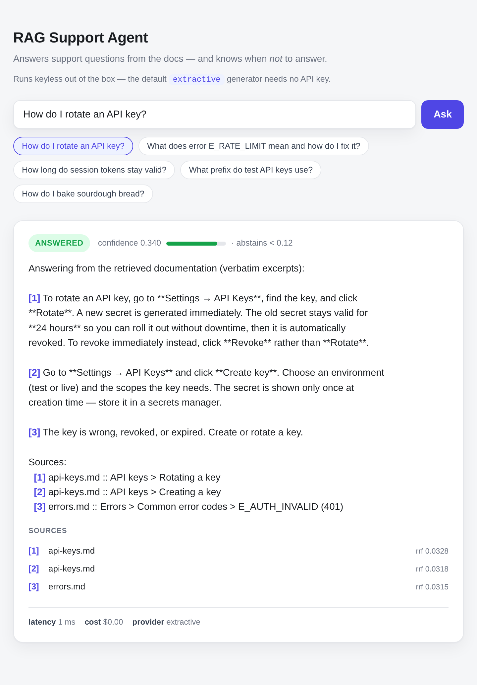
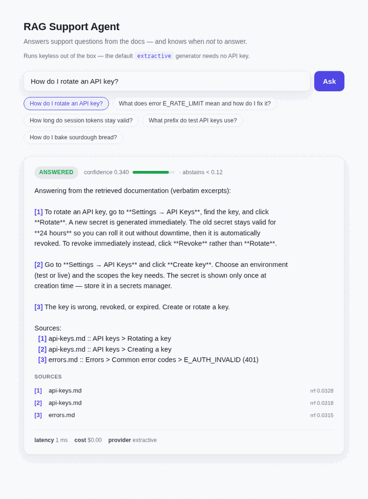

# RAG Support Agent

**A production-grade knowledge assistant that answers support questions from your docs — and knows when *not* to answer.**

Most RAG demos retrieve a few chunks, stuff them into a prompt, and hope. This one is built the way a real support copilot has to be built to survive contact with users: it is **evaluated**, it **abstains when it isn't sure**, it **tracks whether its knowledge is going stale**, and it **reports the questions it couldn't answer** so the knowledge base can be improved.

> **Origin.** This is a clean-room reimplementation of an architecture I designed, shipped, and operated in production (a customer-support knowledge assistant that cut manual support tickets by ~76%). This repository runs the same techniques on **public / synthetic data** — it contains no proprietary code or data from any employer.

---

## Why this is not a toy

The hard part of RAG in production isn't retrieval — it's everything around it. This repo implements the parts that usually get skipped:

| Capability | What it does | Why it matters |
|---|---|---|
| **Evaluation harness** | Precision/recall on retrieval + answer faithfulness against a labeled Q/A set | You can't improve what you don't measure. Turns "seems good" into a number. |
| **Grounded generation + citations** | Answers only from retrieved context, with inline `[n]` citations; refuses parametric memory | An answer you can't trace to a source is an answer you can't trust — or debug. |
| **Confidence + abstention** | Scores answer confidence; says *"I don't know / here's who to ask"* below a threshold | A support bot that hallucinates once loses user trust permanently. |
| **Knowledge freshness / decay** | Tracks source age; flags knowledge units likely to be stale | Docs rot. Yesterday's correct answer is today's wrong answer. |
| **Blind-spot detection** | Logs low-confidence / unanswered queries into a knowledge-gap report | Tells you exactly what to write next. Closes the loop. |
| **Hybrid retrieval** | Vector (pgvector) + keyword (BM25) fusion | Pure vector search misses exact-match terms (error codes, API names). |
| **Cost & latency observability** | Per-request token/cost/latency logging | AI features die in production from silent cost creep. |
| **Thin chat UI** | One vanilla page: streams the answer, shows the confidence badge, citations, and stale flag | The trust signals are only useful if a human can *see* them; live traffic also feeds the gap report. |

---

## Architecture

```
             ┌─────────────┐     ┌──────────────┐     ┌─────────────────┐
  docs  ───▶ │  Ingestion  │ ──▶ │  Knowledge   │ ──▶ │    Retrieval    │
 tickets     │ load/chunk  │     │    units     │     │ pgvector + BM25 │
             └─────────────┘     │ + freshness  │     │  hybrid fusion  │
                                 └──────────────┘     └────────┬────────┘
                                                               │
   ┌──────────────┐   ┌────────────────┐   ┌──────────────────▼────────┐
   │  Chat UI     │◀─ │   Generation   │◀─ │   Context assembly        │
   │  (thin)      │   │ answer + cite  │   │   + relevance gate        │
   └──────────────┘   │ + confidence   │   └───────────────────────────┘
                      │ + abstention   │
                      │ + stale flag   │
                      └───────┬────────┘
                              │  low-confidence / no-source
                              ▼
                   ┌──────────────────────┐
                   │  Blind-spot log  ──▶  │  knowledge-gap report
                   │  Observability   ──▶  │  cost / latency / eval
                   └──────────────────────┘
```

## Stack

Python · FastAPI · PostgreSQL + **pgvector** · Gemini + a keyless *extractive* fallback (pluggable LLM + embedding providers) · BM25 (hybrid) · Docker Compose · a thin chat UI.

---

## Quickstart

```bash
# 1. Bring up Postgres + pgvector
docker compose up -d

# 2. Install
uv sync            # or: pip install -e .

# 3. Ingest the sample docs
python -m rag_support_agent.ingestion.run --source data/sample_docs

# 4. Query it — hybrid retrieval with per-arm scores (M2)
python -m rag_support_agent.retrieval.search --query "401 Unauthorized error" --show-arms

# 5. Ask it — grounded answer with inline citations (M3)
python -m rag_support_agent.generation.ask --query "How do I rotate an API key?"
# real synthesis instead of verbatim excerpts (needs GEMINI_API_KEY in .env):
LLM_PROVIDER=gemini python -m rag_support_agent.generation.ask --query "How do I rotate an API key?"

# 6. Run the API + thin chat UI  (M8)
python -m rag_support_agent.api.server
# open http://localhost:8000 — ask a question (or click an example chip); the answer streams
# in with a confidence badge, citations, and a "possibly stale" flag. Runs keyless. Real
# token streaming turns on with LLM_PROVIDER=gemini / openai.

# 7. Run the eval harness  (M5) — one command → the metrics table
python -m rag_support_agent.eval.run --dataset evaluation/datasets/support_qa.jsonl --calibrate
# semantic retrieval + LLM-judged faithfulness (needs GEMINI_API_KEY + a Gemini-embedded DB):
EMBEDDING_PROVIDER=gemini python -m rag_support_agent.ingestion.run --source data/sample_docs
EMBEDDING_PROVIDER=gemini LLM_PROVIDER=gemini \
  python -m rag_support_agent.eval.run --dataset evaluation/datasets/support_qa.jsonl --calibrate

# 8. Blind-spot + observability  (M7) — seed the query log, then the knowledge-gap report
python -m rag_support_agent.observability.replay --dataset evaluation/datasets/support_qa.jsonl --reset
python -m rag_support_agent.observability.gap_report          # keyless-lexical themes + cost/latency panel
# cluster paraphrases by *meaning* rather than shared words (needs GEMINI_API_KEY):
EMBEDDING_PROVIDER=gemini python -m rag_support_agent.observability.gap_report --mode semantic
```

> **Runs keyless out of the box.** Both the default embedder (`EMBEDDING_PROVIDER=hash`) and
> the default generator (`LLM_PROVIDER=extractive`) are no-API-key stand-ins, so you can try
> the whole flow — ingest → retrieve → grounded, cited answer → abstention — in minutes; set
> `EMBEDDING_PROVIDER=gemini` / `LLM_PROVIDER=gemini` for real embeddings and synthesis.
> Ingestion alone needs no database — try
> `python -m rag_support_agent.ingestion.run --source data/sample_docs --dry-run`.

## Evaluation

The point of the eval harness is that these numbers are **reproducible** — run `eval.run` and
you get them yourself. Two columns, because half the story is *which* metrics need a key: the
**keyless** column runs with zero setup (`EMBEDDING_PROVIDER=hash`, no API key); the
**semantic** column swaps in real Gemini embeddings, where the confidence signal comes alive
(as M2/M4 predicted). Measured on the 23-case labeled set at `confidence_abstain_threshold=0.12`.

| Metric | Keyless (`hash`) | Semantic (Gemini embed) | What it means |
|---|---|---|---|
| Retrieval Recall@5 | 94.1% (16/17) | **100% (17/17)** | gold source is in the top-5 retrieved |
| Answer faithfulness | 100% *by construction* | **100% (11/11)** ¹ | % of answers with zero unsupported claims (LLM-judged) |
| Abstention precision | 62.5% | **70.0% (7/10)** | when it abstains, it should be right to |
| Abstention recall | 62.5% | **87.5% (7/8)** | of the questions that should abstain, how many did |
| p50 / p95 latency | ~30 / ~50 ms | ~480 / ~1170 ms | end-to-end, machine-dependent — semantic pays a per-query embed round-trip |
| Cost / 1k queries | $0 | ~$0.39 ² | approximate serving cost |

¹ **Measured via a cross-provider run, because Gemini's free tier structurally can't complete
the native one.** Faithfulness grades *generated* answers, so it needs a real generator plus
the judge (claim-level entailment against the retrieved context, the judge never seeing the
question — see the *Evaluation harness* write-up below). A full judged pass is ~33
`generate_content` calls (≈20 generation + ~13 to judge the answered records), and Gemini's free
tier caps `generate_content` at **20 requests/day** (`GenerateRequestsPerDayPerProjectPerModel-
FreeTier`, confirmed by the 429 quota metric) — so the Gemini-native run can't finish *regardless
of pacing or the daily reset*: 33 > 20. (The per-minute rate is **not** the blocker — the key
sustains bursts far above an earlier note's "5/min"; the binding limit is the daily cap.) So the
cell is filled by swapping the capped provider out: an **OpenAI generator + OpenAI judge** run
(`gpt-4o-mini`, temperature 0) over the *same* retrieval. It is same-family (OpenAI judging
OpenAI), so the judge's correlated-error caveat still applies — but both providers are now wired,
so the genuinely cross-family pairing (Gemini generate + OpenAI judge) is one flag away once a
paid Gemini key lifts the cap (see the *Evaluation harness* write-up). Because faithfulness is
generator-specific, this cell reports the OpenAI generator's grounding (the column's other cells
are Gemini-generated). Reproduce: `EMBEDDING_PROVIDER=gemini LLM_PROVIDER=openai
OPENAI_API_KEY=... python -m rag_support_agent.eval.run --dataset
evaluation/datasets/support_qa.jsonl`; a paid-tier Gemini key runs the fully native pass with
`LLM_PROVIDER=gemini`. Keyless, faithfulness is 100% *by construction* — the extractive generator
echoes retrieved text verbatim, so there is nothing to hallucinate (reported, not judged).
² Approximate: from M3's measured Gemini token counts (~450 in / ~100 out per query) × Gemini
2.5 Flash list price ($0.30 / $2.50 per 1M in/out). Real per-request cost accounting is M7.

**Calibration (the fil rouge from M4).** M4 shipped `0.12` as a provisional cut; `--calibrate`
sweeps it. Under the semantic embedder, abstention **F1 peaks at 77.8% across τ∈[0.10, 0.15] —
`0.12` sits in that band**, so the guess holds up. Under `hash` the curve is flat (the lexical
signal is muted, exactly M4's honest limit) — now shown as a measured curve, not asserted.

_(See [BUILD-PLAN.md](BUILD-PLAN.md) for the milestone map.)_

---

## Design decisions (the interesting part)

Short write-ups of the non-obvious calls — this is where the engineering lives.

### Chunking: heading-aware, section-scoped

**Decision.** Split each document on Markdown headings first — one chunk per section,
tagged with its full heading path (`API keys > Rotating a key`) — and only *window* a
section into overlapping pieces if it exceeds a size target (1200 chars, 150 overlap).

**Why not fixed-size windows** (the default everyone reaches for). Support docs are
already structured by humans into topic-sized sections, and a heading is the strongest
available signal of what a passage is *about*. Fixed-size chunking cuts across that
structure — it welds the tail of "Rotating a key" onto the head of "Revoking a key," so
one chunk half-answers two questions and cites neither cleanly. Heading-first keeps every
chunk inside a single topic and hands it a precise citation (the heading path), which the
generation step later reuses verbatim.

**Challenge.** Some sections are longer than you want in one chunk, and naive splitting
there drops the sentence that straddles the cut. So the windowing fallback packs whole
*paragraphs* (never mid-paragraph) up to the target and carries a word-aligned overlap
tail into the next window — a fact split across the boundary survives in both pieces.

**What I measured.** On the sample corpus, heading-aware chunking produced a clean **1
chunk per section: 28 chunks across 28 distinct (doc, section) pairs**, max 318 chars,
mean 175. Every section fit under the target, so the windowing path never fired on this
corpus (it's exercised by a unit test with a synthetic long section). That 1:1 mapping is
the payoff — every retrieved unit maps to exactly one documentation heading, so citations
are unambiguous and no vector is diluted by two topics.

**Trade-off / what breaks.** Very short sections (the 62-char minimum here) embed into
thin vectors — fine for keyword/BM25, weaker for dense semantic match. If sections were
routinely tiny I'd merge adjacent small siblings under the same parent heading up to a
floor size. This corpus doesn't need it; a larger one might.

### Why hybrid retrieval over pure vector

**Decision.** Run two retrievers — dense (pgvector cosine over embeddings) and sparse
(BM25 keyword) — fuse them with Reciprocal Rank Fusion, then apply a relevance gate.
Not vector-only.

**Why.** Support questions mix two things that reward *opposite* retrievers:
- **Exact tokens** — error codes (`E_RATE_LIMIT`), status codes (`401`), key prefixes
  (`ak_test_`), header names (`Retry-After`). Embeddings blur these into a neighborhood;
  BM25, with IDF weighting, treats a rare exact token as a strong, precise signal.
- **Paraphrase** — "how do I stop a leaked key from working" for a section titled
  *Revoking a key*, sharing no keywords. BM25 scores ~0 here; a semantic embedding scores
  high.

No single retriever is good at both, and which one a query needs isn't known in advance.
So run both and fuse.

**Why RRF and not a weighted score blend.** Cosine similarity sits in ~[0,1]; BM25 scores
are unbounded and corpus-dependent. Blending them means normalizing incomparable scales
and picking a weight that's really query-dependent. RRF sidesteps that: it fuses on
**rank** (`score = Σ 1/(k + rank)`, k=60), so there's no normalization and no weight to
tune. It's the boring, robust default — and it's unit-tested (`tests/test_fusion.py`).

**The relevance gate.** After fusion, a candidate survives only if the dense arm clears an
absolute cosine floor **or** the sparse arm has any keyword hit. Failing both means
out-of-scope, so the query surfaces *nothing* — which is what lets the agent abstain (M4)
instead of returning its least-bad guess. The gate is a coarse pre-filter; calibrated
abstention (score spread + grounding) is a separate, later threshold.

**What I measured** — reproducible, keyless (`EMBEDDING_PROVIDER=hash`, zero setup):

1. **BM25 recovers a relevant source that pure vector discards.** For `"401 Unauthorized
   error"`, the chunk `api-keys.md > Revoking a key` (a revoked key fails with `401
   Unauthorized` / `E_AUTH_INVALID`) scores dense cosine **0.140 — below the 0.15 gate**,
   so vector-only-plus-gate drops it. BM25 ranks it **#2** on the exact `401` /
   `E_AUTH_INVALID` match, and fusion returns it at **#4**. Hybrid keeps a correct source
   that vector alone threw away.
2. **The gate abstains on out-of-scope.** For `"how do I bake sourdough bread"`, BM25
   returns nothing (no keyword overlap) and the best dense cosine is **0.064**, far under
   the floor — the gate returns **empty**. No hallucinated "closest" source.

```
python -m rag_support_agent.retrieval.search --query "401 Unauthorized error" --show-arms
```

**The semantic half — measured with real embeddings (Gemini).** The default `hash`
embedder is *lexical* (feature-hashing of tokens), so keyless the dense arm and BM25
largely **agree** and fusion barely reorders them. Swap in a semantic embedder and
hybrid's bigger payoff appears — recovering pure *paraphrases* that share no keywords
with the query. Query `"how do I make a leaked credential stop working immediately"`
(no words in common with the section *Revoking a key*), with
`EMBEDDING_PROVIDER=gemini` (`gemini-embedding-001`, 1536-d):

- **Dense ranks `api-keys.md > Revoking a key` #1 (cosine 0.601); BM25 doesn't return it
  at all.** Pure keyword search misses the canonical answer, the vector finds it, hybrid
  keeps it (fused #3). This is the case the lexical `hash` embedder *cannot* show.

```
EMBEDDING_PROVIDER=gemini python -m rag_support_agent.ingestion.run --source data/sample_docs
EMBEDDING_PROVIDER=gemini python -m rag_support_agent.retrieval.search \
  --query "how do I make a leaked credential stop working immediately" --show-arms
```

**A gotcha I measured: the cosine floor does not transfer across embedders.** The 0.15
gate floor makes the gate abstain on `"how do I bake sourdough bread"` under `hash` (best
cosine 0.064). Under Gemini the *same* out-of-scope query scores cosine **~0.44 on
unrelated sections** — Gemini packs everything into a high, compressed band — so a 0.15
floor lets it straight through. Absolute cosine thresholds are provider-specific and need
calibration (that's M5). It's also *why* real abstention (M4) keys off score **spread**
(the gap between the top hit and the rest), which is robust across embedders, rather than
an absolute floor: for the out-of-scope query every hit sits at ~0.43 with no clear
winner, whereas a real hit tops out at 0.60–0.70 with separation.

> **Gemini normalization note.** `gemini-embedding-001` only pre-normalizes its full
> 3072-d output; at the 1536-d we request (to match the pgvector column) vectors return
> with L2-norm ~0.7, so `GeminiEmbedder` L2-normalizes them before storage.

**Also fixed here, found via this measurement.** The dense arm first embedded only the
chunk *body*, so a chunk whose error code lives in its *heading* (`... > E_RATE_LIMIT
(429)`) was near-invisible to vector search — it sat at dense rank **14**. Ingestion now
embeds the heading path together with the body (the stored/cited text stays the pure
body); the same chunk moves to rank **3**. Lesson: embed your headings — they're the
strongest topic label a chunk has.
### Grounding & citations: how the agent is stopped from answering off-context

**Decision.** Answer *only* from retrieved context, attach inline `[n]` citations, and
**abstain** rather than guess. Grounding is enforced in **two independent layers**, and the
generator is pluggable — a keyless `extractive` default and a real `gemini` synthesizer —
behind one interface (mirroring the embedder).

**Why two layers, not one prompt.** A support bot that hallucinates *once* loses user trust
permanently, so the design goal isn't "good answers" — it's "never a confident answer from
parametric memory." A single "use only the context" line in a prompt is a request, not a
guarantee. So:

- **Layer 1 — structural (provider-independent, un-foolable).** If the M2 relevance gate
  returns nothing, the query is out of scope, so the generator is *never called* — the agent
  abstains. This is the gate from the previous section closing the loop into a refusal; it
  holds identically under `extractive` and `gemini` because no model runs.
- **Layer 2 — synthesis.** `ExtractiveGenerator` (the keyless default) grounds *by
  construction*: it echoes the top retrieved passages verbatim, each `[n]`-tagged, so it
  physically cannot invent — the strongest grounding guarantee there is, and it's why the
  repo runs end-to-end for a stranger with no key. `GeminiGenerator` grounds *by prompt*:
  temperature 0, "use only the numbered context, cite every claim," and a refusal sentinel
  (`INSUFFICIENT_CONTEXT`) it emits when the context doesn't answer.

**Why the sentinel, when Layer 1 already abstains on empty retrieval.** The gate is coarse —
a single keyword hit passes it. A passage can clear the gate and still not answer the
question. The sentinel is the model *refusing parametric memory while on topic* — that's M3
grounding, and it's deliberately distinct from M4's calibrated, confidence-threshold
abstention (score spread + a real grounding check).

**Challenge — citations have to be stable handles, not a re-count.** Passages are numbered
`[1..n]`; the model cites what it uses. On `"How do I rotate an API key?"` Gemini cited `[1]`
and `[4]`, *skipping* `[2]` and `[3]`. My first cut re-enumerated the citation list to
`[1],[2]` — so the prose said `[4]` while the list said `[2]`, and a reader couldn't reconcile
them. The fix: a `Citation` carries its **true marker index**, so the number in the prose and
the number in the list always agree. Both generators share one numbering (`format_context`)
and one extractor (`parse_citations`), so a `[n]` means the same passage no matter who wrote
it — and a hallucinated out-of-range marker (`[9]` when `n=5`) is dropped, never turned into a
dangling citation.

**A deliberate knob: thinking is off.** `gemini-2.5-flash` ships with a thinking budget;
grounded extraction over supplied passages isn't a reasoning-heavy task, so I set
`thinking_budget=0`. That buys determinism and roughly halves latency/tokens (an on-topic
sentinel refusal costs **6 output tokens**). If the task were multi-hop reasoning *across*
passages, I'd turn it back on.

**What I measured** (real Gemini, `EMBEDDING_PROVIDER=hash` retrieval so it's reproducible):

| Query | Verdict | Citations | Tokens (in/out) | Latency |
|---|---|---|---|---|
| `How do I rotate an API key?` | answered | `[1]` (Rotating a key) + `[4]` (Best practices) | 455 / 101 | ~1.0 s |
| `What does E_RATE_LIMIT mean and how do I fix it?` | answered | `[1] [2]` `errors.md` **+ `[3]` `billing.md`** | 416 / 137 | ~1.1 s |
| `What is the per-call overage rate in USD?` | **abstained** (sentinel) | — | 472 / **6** | ~0.6 s |
| `how do I bake sourdough bread` | **abstained** (structural) | — | *no LLM call* | — |

- **Multi-source grounding.** The `E_RATE_LIMIT` answer fuses `errors.md` (`[1] [2]`) with
  `billing.md`'s spend-cap note (`[3]`) — a genuinely cross-document citation, each claim
  tagged to its source.
- **Refusing to invent a number.** `"per-call overage rate in USD?"` passes the gate on the
  keyword *overage rate* (`billing.md`), but that doc says the number "is shown on the pricing
  page" — it isn't in the context. Gemini emits `INSUFFICIENT_CONTEXT` instead of guessing a
  figure. Grounding, visibly working on an on-topic query.
- **No hallucinated "closest" source.** `"bake sourdough"` clears neither arm, so the gate
  returns empty and no model runs — the same result under `extractive` and `gemini`.

```
python -m rag_support_agent.generation.ask --query "How do I rotate an API key?"   # keyless
LLM_PROVIDER=gemini python -m rag_support_agent.generation.ask \
  --query "What is the per-call overage rate in USD?"                              # real, abstains
```

**Trade-off / what breaks when it fails.** `extractive` is grounded but not fluent — it
echoes, it can't rephrase or stitch passages together. `gemini`'s grounding is *prompt-*
enforced, not proven: it can still paraphrase-drift or cite loosely. This layer kills the
*easy* hallucinations (no source; on-topic-but-unanswerable); it does **not** certify
faithfulness — that becomes a measured number in M5, and confidence-calibrated abstention is
M4. `Answer.confidence` here is a deliberate placeholder (the top RRF score) that **no
decision reads yet**; M3 abstention keys only off retrieval and grounding.

### Confidence signal: how it's computed and calibrated

**Decision.** Score each answer with a confidence in `[0,1]` and abstain below a threshold —
a *third* abstention path on top of M3's two. Confidence is
`retrieval_spread × grounding_factor`. The backbone, `retrieval_spread`, is how far the top
hit stands above the field on **dense cosine similarity**:
`(d_top − mean(d_of_the_rest)) / d_top`. A clear winner scores high; a flat field of
near-ties scores ~0. When it's below `confidence_abstain_threshold`, the agent abstains and
**points at the closest source** ("I don't have a confident answer — the closest source is
X") — deliberately different from the structural refusal's "nothing here."

**Why spread, and not the three tempting alternatives.**
- **Not the fused RRF score.** It's rank-based and magnitude-blind: for the obvious query
  `"How do I rotate an API key?"` the top RRF is **0.0328** and the runner-up **0.0318** —
  a dead heat that says nothing about how clear the winner is. RRF is the right *ranking*
  signal and the wrong *confidence* signal.
- **Not an absolute cosine floor** (and *not* the M2 gate's 0.15). Absolute cosine doesn't
  transfer across embedders — M2 measured Gemini packing even out-of-scope hits at ~0.43.
  A floor tuned on one embedder silently mis-fires on another. Spread is *relative*, so it
  transfers: a real winner separates from the pack regardless of the absolute band.
- **Not BM25 folded into confidence.** BM25 is unbounded and corpus-scale-dependent;
  including it *destroyed* the separation in testing (it made ambiguous queries look
  confident on incidental keyword overlap). So the two signals get clean, separate jobs:
  **BM25 decides *in-scope* (the M2 gate); dense spread decides *confident* (here).**

**The grounding factor.** Spread answers "is there a clear winner"; grounding answers "is the
drafted answer actually supported by it." For both shipped generators this is **1.0** by
construction — `ExtractiveGenerator` echoes retrieved text verbatim, and `GeminiGenerator` is
pinned to the numbered context (an unsupported answer becomes the M3 Layer-2 sentinel, caught
before we get here). The optional enhancement — an **LLM self-eval** scoring entailment of the
draft — plugs in *here* as a `<1.0` factor for the gemini path. It stays **off by default** so
the pipeline needs no API key; turning "grounded?" into a measured number is M5.

**Challenge — the signal's quality is embedder-bound, and I measured it honestly.** Under the
keyless `hash` embedder the dense arm is *lexical* (≈ BM25, as the M2 write-up shows), so
spread is muted and the confident/ambiguous bands **overlap** — no threshold cleanly separates
on this 28-chunk corpus (flagship `rotate` spreads 0.34 while ambiguous `"tell me about
limits"` spreads ~0.53). The signal only comes alive with a **semantic** embedder, exactly
where M2 predicted real abstention would live. So the keyless path *computes* confidence and
*can* abstain, but the clean separation is demonstrated under Gemini:

| Provider (embedder) | Query | Verdict | Confidence | Which layer |
|---|---|---|---|---|
| `hash` (keyless) | `How do I rotate an API key?` | answered | **0.340** | — |
| `hash` (keyless) | `how do I bake sourdough bread` | abstained | 0.000 | 1 · structural (gate empty) |
| `gemini` | `How do I rotate an API key?` | answered | **0.158** | — |
| `gemini` | `How do I verify a webhook signature?` | answered | **0.223** | — |
| `gemini` | `What is the per-call overage rate in USD?` | abstained | 0.000 | 2 · sentinel (on-topic, unanswerable) |
| `gemini` | `How do I get started?` | **abstained** | **0.095** | **3 · confidence (this milestone)** |
| `gemini` | `how do I bake sourdough bread` | **abstained** | **0.032** | **3 · confidence** |

Under Gemini the spread separates cleanly across the wider probe set: **every clear query
lands in 0.14–0.28, every ambiguous or out-of-scope one at ≤ 0.095** — so the
`confidence_abstain_threshold = 0.12` cut splits them. Two results are worth calling out:

- **The new capability.** `"How do I get started?"` clears the gate and the generator *does*
  produce an answer (extractive can't refuse) — yet M4 withholds it, because the retrieval is
  an ambiguous scatter with no clear winner (spread 0.095), and points at the closest source
  instead. That's the third abstention doing something the M3 layers can't.
- **Spread is the out-of-scope defense a semantic embedder needs.** `"bake sourdough bread"`
  abstains *structurally* under `hash` (the gate returns empty) — but under Gemini the 0.15
  gate floor doesn't transfer, so the query **leaks past the gate** with hits at cosine ~0.44.
  Nothing separates from that flat field (spread 0.032), so the confidence layer catches the
  out-of-scope query the gate no longer can. M2's gate and M4's confidence cover each other's
  blind spots.

**Trade-off / what breaks.** The `0.12` threshold is *one* defensible cut taken from the
measured CLEAR/ambiguous boundary — precise calibration against the labeled set (abstention
precision/recall) is **M5**, not guesswork here. A **lone** gated hit scores spread 0 (there's
no field to stand out from) and is abstained conservatively — a genuinely unique match can be
refused, a deliberate trade to never claim false confidence from a single incidental hit. And
the honest limit above stands: under a purely lexical embedder the signal is too weak to
trust — confidence-calibrated abstention wants a semantic embedder underneath it.

### Evaluation harness: measuring faithfulness without a human, and calibrating abstention

**Decision.** One command (`eval.run`) takes the labeled set end-to-end through the *real*
pipeline and prints the metrics table — Recall@k, abstention precision *and* recall, latency,
cost, and answer **faithfulness**. Faithfulness is measured with an **LLM-as-judge doing
claim-level entailment**, not a human and not a holistic score. The abstention threshold from
M4 is **calibrated** here against the same set.

**How faithfulness is measured without a human — and why this shape.** For every answered
question the judge is handed the retrieved **context** and the **answer**, and asked to split
the answer into atomic claims and label each `SUPPORTED` / `NOT_SUPPORTED` *against the context
only*. Three deliberate choices make the number mean something:

- **Claim-level, not a 1–5 "is this grounded".** A holistic score rewards fluent, plausible
  prose; per-claim entailment forces the judge to find evidence for each assertion, and the
  metric (share of answers with **zero** unsupported claims) is the one a support team actually
  cares about — *one* invented sentence is the failure.
- **The judge never sees the question.** This is the crux: **faithfulness ≠ correctness.** We
  are not asking "is this the right answer" but "is every sentence traceable to the supplied
  passages." Withholding the question (and forbidding outside knowledge) stops the judge from
  rewarding a claim that is *true in the world* but *absent from the context* — which is exactly
  the parametric-memory leak grounding exists to prevent.
- **It is the M4 hook, realized.** M4 left `generation.answer._grounding_factor` pluggable — an
  optional LLM self-eval scoring entailment of the draft. This *is* that primitive, run as an
  eval-time measurement; the identical call can later become the online `<1.0` grounding factor.

Faithfulness is therefore **LLM-gated** (a real generator — Gemini or OpenAI — plus the judge),
and the harness says so: keyless, the extractive generator is grounded *by construction* (it
echoes retrieved text verbatim, so there is nothing to hallucinate) — reported as
100%-by-construction, not judged, because judging a tautology just costs tokens. Recall,
abstention, and latency all run keyless and reproducible.

**Challenge — the harness must not silently re-implement the pipeline.** To calibrate the
threshold I need each answer's *intermediate* signals (which abstention layer fired, the raw
confidence, the context the generator saw) — things `build_answer` collapses into a verdict. So
the harness has an instrumented runner that exposes them. The risk: it drifts from
`build_answer` and the reported numbers describe a *different* pipeline than the one that ships.
The fix is a consistency test (`tests/test_eval.py`) that pins the runner's verdict to
`build_answer`'s on the same inputs — they cannot diverge without a red test. The pure metric
functions are unit-tested the same way; an eval harness whose metrics are wrong is worse than
none.

**What I measured — the threshold calibration (semantic embedder, `--calibrate`).** M4's `0.12`
was a provisional cut; the sweep re-tallies abstention precision/recall at every threshold
(free — every record already carries its reason + confidence, so no re-retrieval, no LLM).
Abstention **F1 peaks at 77.8% across τ∈[0.10, 0.15], and `0.12` sits in that band** — the M4
guess is validated, not re-asserted. The harness deliberately does **not** chase full recall:
one stubborn should-abstain case only gets caught at τ≥0.26, and pushing the threshold there
collapses precision to 42% and answers just **4 of 23** — over-abstention to catch one outlier.
Under `hash` the curve is flat (the lexical signal is muted, exactly M4's honest limit).

**What I measured — the layers cover each other's blind spots.** At `0.12` the single
answered-but-should-have-abstained case is *"what is the exact per-call overage rate in USD?"*
(confidence **0.260** — `billing.md` is a clear retrieval winner, so spread is high — but the
number is "on the pricing page", absent from the context). Confidence (Layer 3) *cannot* catch
this: retrieval genuinely has a clear winner. The **Gemini sentinel (Layer 2)** is exactly what
does — an on-topic-but-unanswerable refusal — which is why that layer earns its keep. And the
three over-abstentions are paraphrases whose home doc has several co-relevant sections (e.g. the
leaked-key question pulling multiple `api-keys.md` sections): the source *is* retrieved
(Recall@5 = 100%) yet the field is flat, so spread stays low. Honest cost of a
"clear-winner" signal.

**What I measured — the semantic-retrieval win, as a delta.** The labeled *"Can I pay in
Dogecoin?"* is answerable — `billing.md` says "we do not accept cryptocurrency" — so it is
labeled `expected_abstain: false, gold_source: billing.md` (a labeling bug fixed in M5). Under
`hash` it is the **one** Recall@5 miss (94.1%): lexical retrieval can't bridge
*dogecoin → cryptocurrency*. Under the semantic embedder it retrieves `billing.md` and answers
(Recall@5 = **100%**, confidence 0.172). A relabel turned into a measured argument for why
semantic retrieval is in the stack.

**Trade-off / what breaks.** N = 23 is small — the calibration *method* and the shape of the
curve are the deliverable, not the second decimal of a threshold; a production set would be
hundreds of labeled tickets. The judge is itself an LLM, and Gemini judging Gemini risks
*correlated error* (a model rating its own phrasing as grounded); it is mitigated by the judge's
task being far narrower than generation (entailment over given text, temperature 0, strict
rubric). The measured cell above runs OpenAI generating *and* judging — **same-family**, so that
caveat still applies (now to OpenAI, not Gemini). The genuinely **cross-family** judge (generate
with one family, judge with the other — which removes the correlation outright) is now a
one-flag swap rather than unbuilt: both providers are wired, so it runs the moment a second
generate-capable key is in play, e.g. a paid Gemini key generating against the OpenAI judge.
Finally the harness is **quota-aware**
— it paces and backs off on a per-minute limit but *fails fast* on a spent daily bucket (keying
off the server's `retryDelay` magnitude, not the quota label), so a run dies in seconds with
guidance instead of burning minutes to fail.

### Knowledge decay: modeling staleness without ground truth

**Decision.** Score every retrieved source's *decay risk* from its last-updated timestamp
and attach a **"possibly stale"** flag to the sources backing an answer. Two complementary
signals, flagged if *either* fires:
- **Absolute** — an exponential half-life over age: `freshness = 0.5 ** (age / half_life)`
  (half-life 180 d by default). Past one half-life (score < 0.5) the source is flagged.
- **Relative** — a source whose age is a strong outlier above the *other retrieved sources*
  (≥ 2× the median peer age, **and** ≥ 90 days older).

Crucially this is a **risk flag, not a correctness verdict** — and why that distinction is
forced on us is the honest core of the milestone.

**Why there's no ground truth (the honest hard part).** Every prior milestone had a right
answer to measure against — a gold source (M2/M5), a faithfulness label (M5). Decay has
none: **nothing in the corpus says "this doc is wrong now."** The only signal is *when the
source was last updated*, and age is a *proxy for decay risk*, not a measurement of
staleness. A five-year-old doc for a stable API is correct; a two-day-old doc can already be
wrong. So M6 cannot output "stale / fresh" — it outputs "re-verify this one first," a triage
signal for a human, and says so on the tin.

**Why two signals — the M4 lesson, reused.** M4 established that a *relative* signal (spread
of the top hit over the field) transfers across embedders where an *absolute* floor (a fixed
cosine) does not. Age has the same trap: an absolute "90 days = stale" threshold is
domain-specific — a pricing page rots in weeks, a legal doc in years — the freshness analogue
of M2's non-transferring cosine floor. So the absolute signal is a *tunable half-life* set to
the domain's rate of change (a policy knob, not learned), **and** a *relative* outlier signal
that transfers across absolute bands catches "this source lags its peers" regardless of the
corpus's overall age. Absolute catches "the whole KB is old"; relative catches "this one is
behind." They cover each other, exactly as M2's gate and M4's spread do.

**Challenge — the timestamp is a checkout artifact.** `source_updated_at` is the file *mtime*
at ingest. A fresh `git clone` stamps every file with the clone time, so absolute age
collapses to ~0 for the entire corpus and the absolute signal silently reports "nothing
stale." I handle it two ways. **(1)** The relative signal degrades correctly: on a uniform
corpus there is no outlier, so it flags *nothing* rather than firing arbitrarily — the honest
"I can't distinguish freshness here" state, pinned by a unit test
(`test_uniform_fresh_clone_flags_nothing`). **(2)** mtime is only the *keyless stand-in*. The
model takes **any** timestamp; in production you feed a real content-change signal — the git
last-commit date, a CMS `updated_at`, the resolution date of the source ticket — and because
ingestion already persists `source_updated_at` as `TIMESTAMPTZ`, swapping the *source* of
that timestamp is a one-line change in `loader.py`, not a schema change.

**What I measured** (keyless, reproducible — `EMBEDDING_PROVIDER=hash`):

| Source (retrieved for *"How do I rotate an API key?"*) | Age | Freshness | Flag |
|---|---|---|---|
| `api-keys.md` — baseline | 6.1 d | **0.977** | — |
| `api-keys.md` — after `touch -d '2 years ago'` + re-ingest | 730 d | **0.060** | **`absolute+relative`** |
| `authentication.md`, `errors.md` — untouched | 6.1 d | 0.977 | — |

Age one source back two years and re-ingest: its freshness drops 0.977 → 0.060, it trips
*both* signals (four half-lives old **and** now the corpus age-outlier), and the answer citing
it carries the warning. The two untouched sources stay fresh — the flag is scoped to the aged
doc, not smeared across the answer. On the intact corpus (every doc ~6 days old) **nothing
flags** — no false alarm.

```
python -m rag_support_agent.generation.ask --query "How do I rotate an API key?"   # clean
touch -d '2 years ago' data/sample_docs/api-keys.md
python -m rag_support_agent.ingestion.run --source data/sample_docs
python -m rag_support_agent.generation.ask --query "How do I rotate an API key?"   # api-keys.md flagged
```

**Trade-off / what breaks.** Age is not wrongness, so both error directions exist and are
unfixable keyless: a stable-but-old doc **false-positives** (flagged though still correct),
and a doc made wrong yesterday by a silent upstream edit **false-negatives** (young, so
unflagged). The half-life is a policy knob, not a learned rate. And the flag is deliberately
scoped to the sources actually **cited** — a stale passage that didn't back the answer isn't
surfaced, because the warning is about *this answer's* footing, not the whole KB (that
corpus-wide "which docs to rewrite next" view is the M7 gap report). A triage signal that
tells a human where to look first — not an oracle that knows what rotted.

### Blind-spot detection & observability: closing the loop

**Decision.** Append **every served query** to a `query_events` log, then read it two ways:
the queries we *couldn't* confidently answer become a **knowledge-gap report** — "the top
things users ask that we can't answer well," i.e. the docs to write next — and the whole log
rolls up into a per-request **cost / latency / token** panel. Every prior milestone made the
bot better at answering; this one makes it tell you *what it can't answer yet*. That's the
loop closing.

**Two views, one append-only table.** Observability wants *all* traffic (what does a query
cost, how slow is p95); blind-spot detection wants only the failures — the `abstained` subset,
which is exactly M3's no-source refusal ∪ the sentinel refusal ∪ M4's low-confidence
abstention. One table serves both. Note the deliberate contrast with `knowledge_units`
(idempotent upsert): `query_events` is **append-only**, because a question asked ten times is
not a duplicate to collapse — that repetition *is* the signal (ten people hit the same gap),
so `count` carries the volume.

**Per-request cost, cross-provider.** Cost is priced onto `Answer.cost_usd` in the thin
`answer_question` layer (the pure `build_answer` seam stays cost- and log-free), reusing the
M5 `eval/cost.py` price table — its scope note reserved this exact wiring for M7. The keyless
extractive path spends no tokens → **$0**, so the default stays free; a real provider's rows
carry the true token-priced cost. Logging is **opt-in and fail-soft**: eval and tests call
`build_answer` directly and never log, and a telemetry write that fails is warned-and-swallowed
— observability must never fail a user's answer. The logged latency is deliberately
*end-to-end* (retrieve → answer), wider than `Answer.latency_ms` (M6's generation-only slice).

**The honest hard part — clustering "what we can't answer" without an LLM.** A good gap report
groups *paraphrases of the same missing topic* into one theme. Grouping by **meaning** needs an
embedding; keyless, all we have is **shared vocabulary**. So, the recurring keyless-coarse
vs. gated pattern once more:
- **Keyless-coarse** (`cluster_lexical`): connected components over the *same* error-code-
  preserving, stopword-stripped tokenizer BM25 ranks on — "the questions retrieval failed on"
  grouped by the very vocabulary retrieval indexes. Deterministic, order-independent, no key.
- **Gated-semantic** (`cluster_semantic`): embed the unanswered queries and merge on cosine.
  Measurable *now* — Gemini **embeddings** aren't under the `generate_content` daily cap the
  M5 write-up hit — so this is a real number, not a promise.

**What I measured (1) — the report + panel over the 23-case log** (keyless, reproducible;
`EMBEDDING_PROVIDER=hash`). Replaying the eval set logs 23 queries, 8 of which abstain:

```
Knowledge-gap report (lexical; abstained 8 / 23)
  1. [1x] about limits          e.g. "Tell me about limits."                          nearest: billing.md
  2. [1x] bake bread            e.g. "How do I bake sourdough bread?"                 nearest: — (nothing cleared the gate)
  3. [1x] between difference    e.g. "What is the difference between Free and Pro?"   nearest: billing.md
  …
Observability (per request):  p50/p95 latency ~30 / ~50 ms   abstain rate 34.8%   mean cost $0   0 tokens
```

The panel proves the keyless path is genuinely free (**$0, 0 tokens**) at a real **~30 / ~50 ms**
end-to-end (matching the eval table's keyless column); under a provider those columns fill with
the token-priced cost. The eight abstentions are eight *distinct* topics, so every theme is
`1×` — which is the honest state of this set, and the segue to (2): the themes only merge when
two questions are the *same* gap.

**What I measured (2) — where lexical breaks and semantic saves it.** Take a disjoint-vocabulary
paraphrase pair and two unrelated abstentions; embed with Gemini (`gemini-embedding-001`, 1536-d):

| cosine | export data | copy-of-data | bread | weather |
|---|---|---|---|---|
| **export data** | 1.000 | **0.685** | 0.485 | 0.502 |
| **copy-of-data** | **0.685** | 1.000 | 0.455 | 0.484 |
| bread | 0.485 | 0.455 | 1.000 | 0.457 |

*"How do I export my data?"* and *"Can I get a copy of everything I've stored?"* share **zero**
salient terms — `cluster_lexical` **cannot** join them — yet sit at cosine **0.685**, while every
unrelated pair sits at **0.455–0.502**. That gap is wide enough for one threshold to merge the
paraphrase and nothing else; `gap_semantic_threshold = 0.62` does exactly that. Run through the
real report: lexical keeps them as two `1×` themes; **semantic collapses them to one `2×`
theme** — the same gap, correctly counted twice:

```
lexical :  [1x] "How do I export my data?"   +   [1x] "Can I get a copy of everything I've stored?"
semantic:  [2x] theme "copy data"  e.g. "How do I export my data?"
```

**Trade-off / what breaks.** The keyless clusterer is **single-linkage on shared words**: it
misses the disjoint-vocabulary paraphrase above (only the embedding joins it) *and* can chain
(A–B on one term, B–C on another, so A and C land together) — both are the price of having no
embedding. The semantic path needs a key, and its `0.62` cutoff is **embedder-specific** — the
same absolute-threshold caveat as M2's cosine floor, M4's spread, and M6's half-life: retune it
per embedding model, don't assume it transfers. Theme *labels* are coarse for a lone query (they
default to its top salient terms, so a contraction can leave a stray `s`); the label sharpens
into real shared vocabulary only once a cluster has volume, which is where it matters. And a
**privacy** note: logging *user* queries is PII-sensitive — here every query is synthetic (the
23-case set), and the schema is where a retention/redaction policy would live in production.

```
python -m rag_support_agent.observability.replay --dataset evaluation/datasets/support_qa.jsonl --reset
python -m rag_support_agent.observability.gap_report                              # keyless-lexical + panel
EMBEDDING_PROVIDER=gemini python -m rag_support_agent.observability.gap_report --mode semantic
```

### Thin chat UI: streaming as the keyless-coarse-vs-gated pattern, one last time



**Decision.** Ship a single vanilla HTML/CSS/JS page (no framework, no build step) behind two
FastAPI endpoints: `POST /ask` returns the whole grounded `Answer` as JSON (the tested data
contract), and `GET /ask/stream` delivers the same answer over Server-Sent Events. Every prior
milestone *computed* a trust signal — confidence, citations, a stale flag, a per-request cost —
and left it on the `Answer`. This one is where a human finally *sees* them, and where live UI
traffic feeds the M7 blind-spot log (`record_event=True`) so the knowledge-gap report closes the
loop over *real* questions, not just a replayed eval set.

**The honest hard part — there is nothing to stream keyless.** The pipeline is blocking: no
partial answer exists until `build_answer` finishes, and the keyless `ExtractiveGenerator`
produces its whole answer in one shot — it *echoes* retrieved passages, so there are no tokens
to trickle out. Real token streaming lives only behind a provider's streaming API
(`generate_content_stream` / `stream=True`). So streaming is the same **keyless-coarse vs.
gated** split every milestone has hit (M2 lexical-vs-semantic retrieval, M6 mtime-vs-real
timestamp, M7 lexical-vs-semantic clustering): the SSE *transport* is uniform, but
token-by-token streaming is gated on gemini/openai, and the extractive path degrades to a single
whole-answer event. The UI renders incrementally either way — and, the point, the repo still
runs end-to-end for a stranger with no key.

**Challenge — streaming must never retract a token.** Abstention can withhold an answer, and two
of the three layers traditionally decide *around* generation: the M3 sentinel refusal (Layer 2)
and the M4 confidence cut (Layer 3). Stream first and abstain second, and the user watches text
appear only to have it yanked. The fix leans on what each layer actually depends on: **Layer 3 is
a pure function of retrieval** (the dense-cosine spread — it never needed the drafted text), so
it gates *before* the first token; and **Layer 2 is caught by buffering just the opening of the
stream** (up to the sentinel's length) before releasing anything. Only past all three does a
token reach the browser, so a refused answer never flashes on screen. This kept a discipline the
repo cares about: the streaming path is a pure `stream_answer` seam that builds its final
`Answer` from the *same* helpers as blocking `build_answer` (`compute_confidence`,
`_citations_from`, `_stale_cited_sources`), pinned by a consistency test — the identical move M5
used to stop its eval runner drifting from `build_answer`.

**What I measured** (keyless, over the live server — `EMBEDDING_PROVIDER=hash`,
`LLM_PROVIDER=extractive`):

| Query | Verdict | Confidence | SSE token events |
|---|---|---|---|
| `How do I rotate an API key?` | answered | 0.340 | 1 (whole answer) |
| `How long do session tokens stay valid?` | answered | 0.856 | 1 |
| `How do I bake sourdough bread?` | **abstained** (structural) | 0.000 | **0** |
| `How do I verify a webhook signature?` | **abstained** (confidence) | 0.000 | **0** |

The extractive path emits its answer as a single token event, then a `done` event carrying the
badges; an abstention emits **zero** token events (the decision is made before any release) then
the `done`. Cost is **$0** at a few ms end-to-end, and every served query is appended to the M7
`query_events` log — so the gap report now reflects what people actually typed into the box,
which is the loop finally closing.



Those two rows, live — the whole pitch in one loop: it answers *with* citations and a confidence
badge when the docs support it, and it *abstains* (no sources, confidence 0.000) when they don't.

**Trade-off / what it does _not_ do.** Keyless, "streaming" is honest-but-cosmetic: the transport
is SSE, but a stranger sees the whole extractive answer paint at once, because there are no
provider tokens to stream. Real token streaming needs `LLM_PROVIDER=gemini`/`openai`, which I
implemented but could only lightly exercise — Gemini's free tier caps `generate_content` at
20/day and there's no OpenAI key here; what's verified end-to-end is the keyless one-shot path,
the SSE framing, and the `stream_answer`↔`build_answer` parity. The confidence *meter* is a
display scaling of the spread signal, not a new measurement. And M4's honest limit is visible
right in the demo: under the `hash` embedder the confidence layer is muted, so an ambiguous
question like *"How do I get started?"* **answers** instead of abstaining — that separation only
appears under a semantic embedder. The UI is deliberately thin — one page, one input, no auth, no
rate limit, single user — and it inherits M7's privacy note: logging real user queries is
PII-sensitive, and the `query_events` schema is where a retention/redaction policy would live.
(One gotcha caught here: with `from __future__ import annotations`, a Pydantic request model
defined *inside* the app factory is an unresolvable forward-ref for FastAPI's `get_type_hints`,
which then silently reinterprets the body as query params — the model has to live at module
scope.)

```
python -m rag_support_agent.api.server                       # keyless; open http://localhost:8000
LLM_PROVIDER=gemini python -m rag_support_agent.api.server   # real token streaming (respects the 20/day cap)
```

### Self-hosted pgvector vs a managed vector DB (cost/control trade-off)

**Decision.** Keep the vectors in a Postgres I run myself — `pgvector/pgvector:pg16` behind a
one-line `docker compose up -d`, a single `db` service, a `CREATE EXTENSION vector` init script,
and an HNSW index on the `embedding vector(1536)` column. No dedicated vector database (Pinecone
/ Weaviate / Qdrant Cloud), and no managed vector service — for now.

**Why.** The dense arm is *already* SQL: `1 - (embedding <=> %s)` ordered by the same `<=>`
cosine-distance operator the `vector_cosine_ops` index is built on. Because it's Postgres, the
vectors live in the *same* store as everything relational the repo needs — the `knowledge_units`
rows BM25 reads for the sparse arm (M2), and the append-only `query_events` log the blind-spot
report reads (M7). One store means hybrid fusion has no cross-system join and no
vector-index-vs-source-of-truth consistency gap: the row I rank by cosine *is* the row I cite and
the row I log, under one transaction and one backup. A dedicated vector DB would split that into
two systems to keep in sync, two backups, two failure modes — plus a per-vector or per-pod bill —
to buy nothing this corpus needs. And the decisive reason for a *portfolio*: "runs for a stranger
with `docker compose up` and $0 of infra" is this repo's Definition of "portfolio-ready"
(keyless-first, everywhere). A hosted vector DB with a signup and a key would break that on the
very first step.

**The honest part — this isn't "pgvector vs Pinecone," it's "who runs the Postgres."** I'd keep
pgvector either way; the real axis is self-hosted vs a managed pgvector (Supabase / Neon / RDS).
I chose self-hosted for reproducibility and $0, and that choice buys nothing at scale — it
*costs*. It's a single node: I own backup, upgrade, and ops; there's no replication and no HA; a
lost `pgdata` volume takes the `query_events` history with it (the `knowledge_units` re-ingest
from `data/sample_docs` — the real logged traffic doesn't). The HNSW index runs on **default
build parameters** (`m`, `ef_construction`, and query-time `ef_search` all untouched) — fine
here, but recall and latency on *millions* of vectors is exactly the tuning-and-sharding a managed
service exists to do for you. What self-hosting buys is control and $0; what it doesn't buy is
someone else being paged.

**What I can honestly measure — nothing about scale, and that's the point.** The corpus is **28
vectors** (5 docs → 28 chunks). At 28 rows HNSW is *theatre*: a sequential scan returns identical
results and the ANN index earns nothing — it's in the schema to show the production *shape*, not
because this corpus needs it. The cost of the dense arm here is entirely the **embed round-trip**,
not the search: the Evaluation table's ~480 ms semantic p50 is the per-query Gemini embed call;
the pgvector lookup itself is negligible beside it. So any claim this design "scales to millions"
would be **untested** — I have measured it at 28 vectors and nowhere else, and I'm saying so out
loud rather than implying the HNSW index proves otherwise.

**Trade-off / what it does _not_ do.** This is the cheap, reproducible end of the trade: total
control, one store, $0 — but I am the operator, there is no HA, and the HNSW knobs that matter at
scale are unturned and unmeasured. The saving grace is that the *exit* is nearly free, precisely
because it's pgvector-in-Postgres: moving to a managed pgvector (Supabase / Neon / RDS) the day HA
or ops actually matter is a **connection-string change, not a re-architecture** — same
`vector(1536)` column, same `<=>` queries, same HNSW index, same relational tables alongside. The
schema I'd migrate *to* is the schema already committed. Swapping to a *dedicated* vector DB, by
contrast, would be a rewrite, and would surrender the single-store property that lets M2's hybrid
and M7's log share one transaction and one backup. So the decision isn't "pgvector is best at
scale" — it's "pgvector is the right *first* store, and the one whose scale-up doesn't throw the
schema away."

## License

GPLv3 — see [LICENSE](LICENSE). Copyleft on purpose: this is a public reference
implementation, and I want derivatives to stay open.
